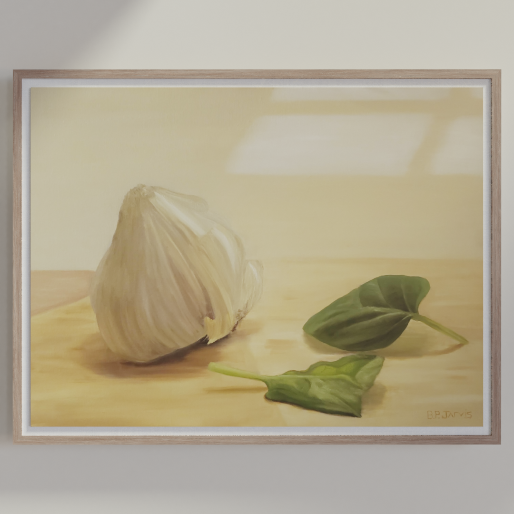

# art-viz

 Hanging art simulation tool using Blender command line tools & Python. Visualize how your art will look hanging on a wall with photo-realistic, computer-generated lighting.

> This repository is in active development. Check again in the future for future developments.

**Usage:** `blender -b <filename> -P <this_script> -- <image_path> <width-inches> <height-inches> <depth-inches> <renderer>`

**Example:** `blender -b .\art-viz.blend -P render.py  -- .\garlic.jpg 18 24 1 CYCLES WoodFloatingFrame02`

***Original***

***Result***

*More frames will be added in future updates soon!*

## Dependencies

- Blender 2.8+
  - Created using 2.93
- Blender executable folder **must** be added to PATH to run the `blender` cmd
- Python 2.8+
  - Created using 3.8.2

## Development

- [x] Render scene via command line

- [x] Import image and apply to material

- [x] Export render to absolute file path

- [x] Resize canvas via args

- [x] Select renderer via args

- [x] Design custom frames

- [x] Select frame type via args

- [ ] Set wall color via args

- [ ] Activate decor objects via args & json

## Args

### Blender Command Line Args

Start by copy and pasting this before you add custom args:

`blender -b .\art-viz.blend -P render.py   --`

Everything that comes after `--` will be user-defined arguments, parsed in `render.py`.

Separate custom arguments with spaces after the `--` symbol. There must be a space on either side of the `--`.

### Image Path

ex: `apples.png`

This should be an image that exists in the root folder of this repository. Example use case could be a raw, cropped picture of a finished piece. Include the file extension in the name.

### Width

ex: `20`

The width of the real piece in inches.

### Height

ex: `16`

The height of the real piece in inches.

### Depth

ex: `.75`

The depth of the real piece in inches.

### Renderer

The type of renderer that Blender will use.

Options are `CYCLES`, `BLENDER_EEVEE`, or `BLENDER_WORKBENCH`.

### Frame Type

The frame that will surround the piece.

Current framing options are

- `WhiteFloatingFrame`

- `BlackFloatingframe`

- WoodFloatingFrame01

- WoodFloatingFrame02

- WoodFloatingFrame03

- WoodFloatingFrame04

- WoodFloatingFrame05

> :exclamation:This list will be added to in the near future for more interesting customization
