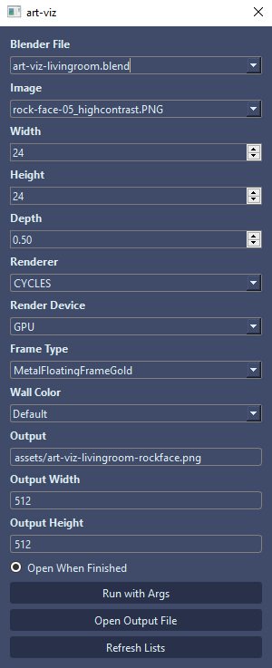

# art-viz

 Hanging art simulation tool using Blender command line tools & Python. Visualize how your art will look hanging on a wall with photo-realistic, computer-generated lighting.

> This repository is in active development. Check again in the future for future developments.

- [art-viz](#art-viz)
  - [Usage](#usage)
    - [Example](#example)
  - [Dependencies](#dependencies)
  - [Development](#development)
  - [Args](#args)
    - [Blender Command Line Args](#blender-command-line-args)
    - [Image Path](#image-path)
    - [Width](#width)
    - [Height](#height)
    - [Depth](#depth)
    - [Renderer](#renderer)
    - [Frame Type](#frame-type)
      - [Frame Options](#frame-options)
    - [Wall Color](#wall-color)
    - [Output](#output)
    - [Output Width](#output-width)
    - [Output Height](#output-height)
  - [Qt Interface](#qt-interface)
  - [Tips](#tips)

## Usage

 `blender -b <filename> -P <this_script> -- [--image or -I] <image-path> [--width or -W] <width-inches> [--height or -H] <height-inches> [--depth or -D] <depth-inches> [--renderer or -R] <renderer> [--frameType or -FT] <frame-type> [--wallColor or -WC] <wall-color-hex> --output <output-file-name>`

### Example

```bash
blender -b art-viz.blend -P render.py -- -I peaches.png -W 24 -H 18 -D .5 -R  CYCLES -FT ClassicFrameMattedWalnut -WC E4DED5 --output peaches_output.png
```

|Input |Output       |
|---      |---          |
| | |

*More frames will be added in future updates soon!*

[:arrow_up: Back to Top](#art-viz)

## Dependencies

- Blender 2.8+
- Local Blender executable folder **must** be added to PATH
- Python 3.8.2+
- PySide6
  - Only required if you want to use the optional args input interface
  - Install with `pip install pyside6`

## Development

- [x] Render scene via command line

- [x] Import image and apply to material

- [x] Export render to absolute file path

- [x] Resize canvas via args

- [x] Select renderer via args

- [x] Design custom frames

- [x] Select frame type via args

- [x] Make certain args optional

- [x] Set wall color via args

- [x] Output resulution arg

- [x] Qt interface alternative

- [x] Store and load last used Qt values for the next Qt instance

- [ ] Arg to save & load certain arg values as default prefs

- [ ] Activate decor objects via args & json

- [ ] Control lighting via args or json

[:arrow_up: Back to Top](#art-viz)

## Args

### Blender Command Line Args

Start by copy and pasting this before you add custom args:

```markdown
blender -b .\art-viz.blend -P render.py   -- 
```

Everything that comes after `--` will be user-defined arguments, parsed in `render.py`.

Separate custom arguments with spaces after the `--` symbol. There must be a space on either side of the `--`.

### Image Path

ex: `peaches.png`

This should be an image that exists in the root folder of this repository. Example use case could be a raw, cropped picture of a finished piece. Include the file extension in the name.

### Width

ex:`--width 20` or `-W 20` 

The width of the real piece in inches.

### Height

ex: `--height 16` or `-H 16`

The height of the real piece in inches.

### Depth

ex: `--depth .75` or `-D .75`

The depth of the real piece in inches.

### Renderer

ex: `--renderer CYCLES` or `-R CYCLES`

The type of renderer that Blender will use.

|Renderer         |Arg                |
|---              |---                |
|Cycles (default) |`CYCLES`           |
|Eevee            |`BLENDER_EEVEE`    |
|Workbench        |`BLENDER_WORKBENCH`|


### Frame Type

ex: `--frameType WhiteFloatingFrame` or `-FT WhiteFloatingFrame`

The frame that will surround the piece.

[:arrow_up: Back to Top](#art-viz)

#### Frame Options

Current `frameType` options are:

|   Name   |   Preview   |
|---|---|
|`WhiteFloatingFrame`       |                      |
|`BlackFloatingframe`       |                      |
|`WoodFloatingFrame01`      |                    |
|`WoodFloatingFrame02`      |                    |
|`WoodFloatingFrame03`      |                    |
|`WoodFloatingFrame04`      |                    |
|`WoodFloatingFrame05`      |                    |
|`MetalFloatingFrameSilver` |          |
|`MetalFloatingFrameGold`   |              |
|`MetalFloatingFrameBlack`  |            |
|`OrnamentalFrame01`        |                     |
|`VeronaNarrowFrameBlack`   |           |
|`VeronaFrameMattedBlack`   |           |
|`VeronaFrameMattedCherry`   |        |
|`VeronaFrameMattedEspresso`   |  |
|`VeronaFrameMattedWalnut`   |        |
|`VeronaFrameMattedMaple`   |           |
|`VeronaFrameMattedWashedBlack`   |  |
|`VeronaFrameMattedWashedWhite`   |  |
|`VeronaFrameMattedRoughGrey`   |  |
|`ClassicFrameMattedBlack`   |  |
|`ClassicFrameMattedWhite`   |  |
|`ClassicFrameMattedCherry`   |  |
|`ClassicFrameMattedEspresso`   |  |
|`ClassicFrameMattedMaple`   |  |
|`ClassicFrameMattedWalnut`   |  |
|`ClassicFrameMattedMetalBlack`   |  |
|`ClassicFrameMattedMetalSilver`   |  |
|`ClassicFrameMattedMetalGold`   |  |
|`ClassicFrameMattedWashedWhite`   |  |
|`ClassicFrameMattedWashedBlack`   |  |


> :exclamation: This list will be updated as I create more frame models!

### Wall Color

ex: `--wallColor E4DED5` or `-WC E4DED5`

Set the hex color of the wall.

Optional. Defaults to E4DED5 - a warm off-white - if not set.

Some colors you can try from [Benjamin Moore](https://convertingcolors.com/list/benjamin-moore.html) or [ColorHunt.co](https://colorhunt.co/)

|Color Name       |Hex      |Tint       |
|---              |---      |---        |
|Deep Sea         |`002831` |Blue       |
|Dark Navy        |`2B2D42` |Blue       |
|Cool Grey        |`8D99AE` |Grey       |
|Anti-Flash White |`EDF2F4` |White      |
|Terra            |`DEBFA0` |Green/Brown|
|Fiji             |`4F8093` |Blue       |
|Caponata         |`463234` |Red        |
|Salmon           |`F29479` |Pink       |
|Herb             |`63774A` |Green      |
|Mint             |`D5DFCC` |Green      |
|Vintage          |`575E50` |Green      |
|Deep Red         |`310500` |Red        |
|Dirty Grey       |`545041` |Brown      |
|Strong Blue      |`202B54` |Blue       |
|Honeydew         |`C0E1B9` |Green      |
|Sioux            |`80968F` |Blue       |
|Deep             |`265557` |Blue       |
|Lazy             |`5F90B7` |Blue       |
|Stunning         |`424B63` |Blue       |

### Output

ex: `--output peaches_rendered.png` or `-O peaches_rendered.png`

The desired name of the final render. Writes to the relative directory.

### Output Width

ex: `--outputWidth 1024` or `-OW 1024`

The desired resolution width of the final rendered image.

Optional. Defaults to 1024.

### Output Height

ex: `--outputHeight 1024` or `-OH 1024`

The desired resolution height of the final rendered image.

Optional. Defaults to 1024.

## Qt Interface

For convenience, I've added a script that will display a user interface for faster argument input and editing. If you would like, you can run the script `RenderArgsQt.py`. PySide6 **must** be installed (you can install via `pip install pyside6`).

Run in the repository root directory with:

```bash
& python .\RenderArgsQt.py
````



## Tips

- If the result is too small, double the size values (height/width/depth) to make the art appear larger in the final image
- When testing out new wall colors, speed up render times using `BLENDER_EEVEE` instead of the longer (but better quality) `CYCLES`

[:arrow_up: Back to Top](#art-viz)
